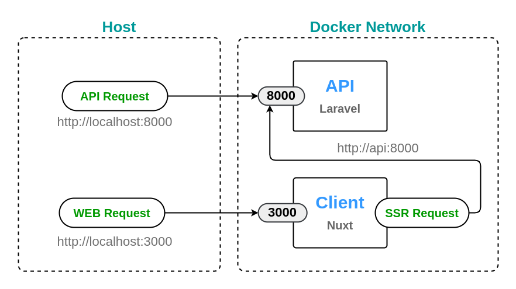

[](https://stand-with-ukraine.pp.ua)

# Dockerized template for your next project with Laravel and Nuxt

## 🍬 Stack

* API
  * Laravel (latest version) + Octane server
  * PostgreSQL
  * Redis
  * Mailpit
  * Minio
* WEB
  * Nuxt (latest version)
* Reverse proxy
  * Traefik

## ⚙ Installation

Clone or download the repository:

```bash
git clone https://github.com/nevadskiy/laravel-nuxt-docker.git
```

Install [API](api/README.md), [WEB](web/README.md), and [reverse-proxy](reverse-proxy/README.md) (optionally for local development) using their installation instructions.

## 🔌 Network communication

The following image demonstrates the request paths in a local development environment.



API and WEB requests sent by the browser are proxied directly via published ports to the running server instances.

But the SSR request is sent by the node server, not the browser, and should be sent directly to the host of the API docker service.

For production environment it is recommended to configure a Reverse Proxy Server that will handle all incoming requests.

## ☕ Contributing

If you see anything that can be improved, feel free to make a pull request. Contributions are welcome and will be fully credited.
