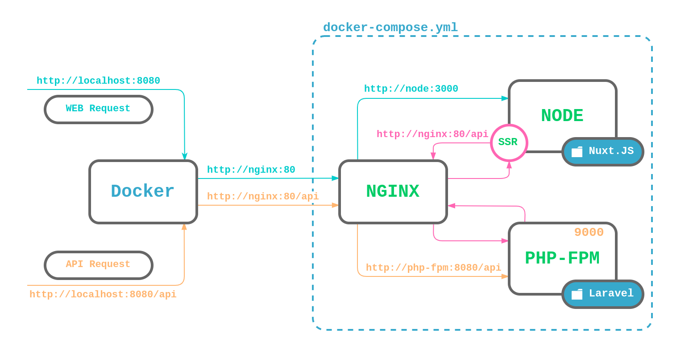

## Dockerized starter template for Laravel + Nuxt.JS project.

## Overview
Look at one of the following topics to learn more about the project

* [Stack](#stack-includes)
* [Structure](#about-the-structure)
* [Installation](#installation)
* [Basic usage](#basic-usage)
    * [Manual installation](#manual-installation)
* [Environment](#environment)
* [Nuxt](#nuxt)
* [Laravel](#laravel)
    * [Artisan](#artisan)
    * [File storage](#file-storage)
* [Makefile](#makefile)
* [Aliases](#aliases)
* [Database](#database)
* [Redis](#redis)
* [Mailhog](#mailhog)
* [Logs](#logs)
* [Running commands](#running-commands-from-containers)
* [Reinstallation](#reinstallation)
    * [Nuxt](#reinstallation-nuxt)
    * [Laravel](#reinstallation-laravel)

## Stack includes
* Laravel (clean 6.4 version)
* Nuxt.JS (clean 2.10 version)
* PostgreSQL 11.3
* Nginx
* Redis 3.0
* Supervisor (queues, schedule commands, etc.)
* Mailhog (SMPT testing)

#### Also
* Bash aliases for simple cli using
* A lot of useful **make** commands
* A separate testing database

## About the structure
Laravel API and Nuxt are totally separate from each other and there are some reasons why I don't mix them up.
- First, throwing two frameworks together is a guaranteed mess in the future.
- API should be the only one layer of coupling. 
- You can host them on the different servers.
- You can even split them into separate repositories if (when) the project will grow.  
- You can even add a third project, for example, a mobile APP, which will use the same API also.

## Installation
**1. Clone or download the repository and enter its folder**
```
git clone https://github.com/nevadskiy/laravel-nuxt-docker.git your-app-folder
cd your-app-folder
```

**2. Run the installation script (it may take up to 10 minutes)**
```
make install
```

**3. That's it.** 

Open [http://localhost:8080](http://localhost:8080) url in your browser. 

_If you see the 502 error page, just wait a bit when ```yarn install && yarn dev``` process will be finished (Check the status with the command ```docker-compose logs node```)_

#### Manual installation
If you do not have available the make utility or you just want to install the project manually, you can go through the installation process running the following commands:

**Build and up docker containers (It may take up to 10 minutes)**
```
docker-compose up -d --build
```

**Install composer dependencies:**
```
docker-compose exec php composer install
```

**Copy environment files**
```
cp .env.api api/.env
cp .env.client client/.env
```

**Set up laravel permissions**
```
sudo chmod -R 777 api/bootstrap/cache
sudo chmod -R 777 api/storage
```

**Restart the node container**
```
docker-compose restart node
```

## Basic usage
Your base url is ```http://localhost:8080```. All requests to Laravel API must be sent using to the url starting with `/api` prefix. Nginx server will proxy all requests with ```/api``` prefix to the node static server which serves the Nuxt. 

There is also available [http://localhost:8081](http://localhost:8081) url which is handled by Laravel and should be used for testing purposes only.

You **don't** need to configure the api to allow cross origin requests because all requests are proxied through the Nginx.

The following image demonstrates a request path going through the environment.


## Environment
To up all containers, run the command:
```
# Make command
make up

# Full command
docker-compose up -d
```

To shut down all containers, run the command:
```
# Make command
make down

# Full command
docker-compose down
```

## Nuxt
Your application is available at the [http://localhost:8080](http://localhost:8080) url.

Take a look at `client/.env` file. There are two variables:
```
API_URL=http://nginx:80
API_URL_BROWSER=http://localhost:8080
```
`API_URL` is the url where Nuxt sends requests during SSR process and is equal to the Nginx url inside the docker network. Take a look at the [image above](#basic-usage).

`API_URL_BROWSER` is the base application url for browsers.

Example of API request:
```
this.$axios.post('/api/register', { 
    email: this.email, 
    password: this.password 
});
```

#### Dependencies
If you update or install node dependencies, you should restart the Nuxt process, which is executed automatically by the node container:
```
# Make command
make rn

# Full command
docker-compose restart node
```

## Laravel
Laravel API is available at the [http://localhost:8080/api](http://localhost:8080/api) url.   

There is also available [http://localhost:8081](http://localhost:8081) url which is handled by Laravel and should be used for testing purposes only.

#### Artisan
Artisan commands can be used like this:
```
docker-compose exec php php artisan migrate
```

But if you want to generate a new controller or any laravel class, all commands should be executed from the current user like this, which grants all needed file permissions
```
docker-compose exec --user "$(id -u):$(id -g)" php php artisan make:controller HomeController
```

However, to make the workflow a bit simpler, there is the _aliases.sh_ file, which allows to do the same work like this:
```
artisan make:controller HomeController
```
[More about aliases.sh](#Aliases)

#### File storage
Nginx will proxy all requests with the `/storage` path prefix to the Laravel storage, so you can easily access it.
Just make sure you run the `artisan storage:link` command (Runs automatically during the `make install` process).

## Makefile
There are a lot of useful make commands you can use. 
All of them you should run from the project directory where `Makefile` is located.

Examples:
```
# Up docker containers
make up

# Apply the migrations
make db-migrate

# Run tests
make test

# Down docker containers
make down
```

Feel free to explore it and add your commands if you need them.

## Aliases
Also, there is the _aliases.sh_ file which you can apply with command:
```
source aliases.sh
```
_Note that you should always run this command when you open the new terminal instance._

It helps to execute commands from different containers a bit simpler:

For example, instead of
```
docker-compose exec postgres pg_dump
```

You can use the alias `from`:
```
from postgres pg_dump
```

But the big power is `artisan` alias

If you want to generate a new controller or any Laravel class, all commands should be executed from the current user, which grants all needed file permissions
```
docker-compose exec --user "$(id -u):$(id -g)" php php artisan make:model Post
```

The `artisan` alias allows to do the same like this:
```
artisan make:model Post
``` 

## Database
If you want to connect to PostgreSQL database from external tool, for example _Sequel Pro_ or _Navicat_, use the following parameters
```
HOST: localhost
PORT: 54321
DB: app
USER: app
PASSWORD: app   
```

Also you can connect to DB with CLI using docker container:
```
// Connect to container bash cli
docker-compose exec postgres bash
    // Then connect to DB cli 
    psql -U ${POSTGRES_USER} -d ${POSTGRES_DB}
```

For example, if you want to export dump file, use the command
```
docker-compose exec postgres pg_dump ${POSTGRES_USER} -d ${POSTGRES_DB} > docker/postgres/dumps/dump.sql
```

To import file into database, put your file to docker/postgres/dumps folder, it mounts into /tmp folder inside container
```
// Connect to container bash cli
docker-compose exec postgres bash
    // Then connect to DB cli 
    psql -U ${POSTGRES_USER} -d ${POSTGRES_DB} < /tmp/dump.sql
```

## Redis
To connect to redis cli, use the command:
```
docker-compose exec redis redis-cli
```

If you want to connect with external GUI tool, use the port ```54321```

## Mailhog
If you want to check how all sent mail look, just go to [http://localhost:8026](http://localhost:8026).
It is the test mail catcher tool for SMTP testing. All sent mails will be stored here..

## Logs
All **_nginx_** logs are available inside the _docker/nginx/logs_ directory.

All **_supervisor_** logs are available inside the _docker/supervisor/logs_ directory.

To view docker containers logs, use the command:
```
# All containers
docker-compose logs

# Concrete container
docker-compose logs <container>
```

## Running commands from containers
You can run commands from inside containers cli. To enter into the container run the following command:
```
# PHP
docker-compose exec php bash

# NODE
docker-compose exec node /bin/sh
```

## Reinstallation

#### Reinstallation Laravel
**If you want to reinstall Laravel from scratch with the fresh version, use the following commands:**

Remove the old Laravel directory and create a new empty one
```
sudo rm -rf api
mkdir api
```

Restart docker containers to allow to remount the ```api``` directory
```
docker-compose restart
```

Create a new Laravel project 
```
docker-compose exec php composer create-project --prefer-dist laravel/laravel .
```

Give permissions for all files and directories generated by docker user
```
sudo chown ${USER}:${USER} -R api
```

Set up Laravel permissions
```
sudo chmod -R 777 api/bootstrap/cache
sudo chmod -R 777 api/storage
```

Update environment variables and generate the Laravel application key
```
sudo rm api/.env
cp .env.api api/.env
docker-compose exec php php artisan key:generate --ansi 
```

Install the Redis PHP client
```
docker-compose exec php composer require predis/predis
```

Open [http://localhost:8081](http://localhost:8081) in your browser and make sure it works

#### Reinstallation Nuxt
**If you want to reinstall Nuxt.JS from scratch with the fresh version, use the following commands:**

Remove the old Nuxt directory and create a new empty one
```
sudo rm -rf client
mkdir client
```

Restart Docker containers to allow to remount the ```client``` directory
```
docker-compose restart
```

Create a new Nuxt project with axios module and other preferable configurations (recommended: no custom server framework, universal rendering mode, yarn package manager)
```
docker-compose exec node yarn create nuxt-app .
```

Give permissions for all files and directories generated by docker user
```
sudo chown ${USER}:${USER} -R client
```

Add the environment file
```
cp .env.client client/.env
```

Install dotenv nuxt module
```
docker-compose exec node yarn add @nuxtjs/dotenv --dev
```

Include the dotenv module to the nuxt.config.js file 
```
buildModules: [
    // ...
    '@nuxtjs/dotenv'
],
```

Import dotenv module to the very top of the nuxt configuration file
```
require('dotenv').config()

export default {
  // your usual nuxt config.
}
```

Restart Docker containers again for starting the fresh Nuxt instance
```
docker-compose restart node
```

Open [http://localhost:8080](http://localhost:8080) in your browser and make sure it works

##### TODO LIST:
- [ ] add a mysql branch
- [ ] add a prod build
- [ ] migrate to SSL
- [ ] HTTP2
- [ ] add laravel-echo-server container for websocket integration
- [ ] add selenium container and instructions about testing
